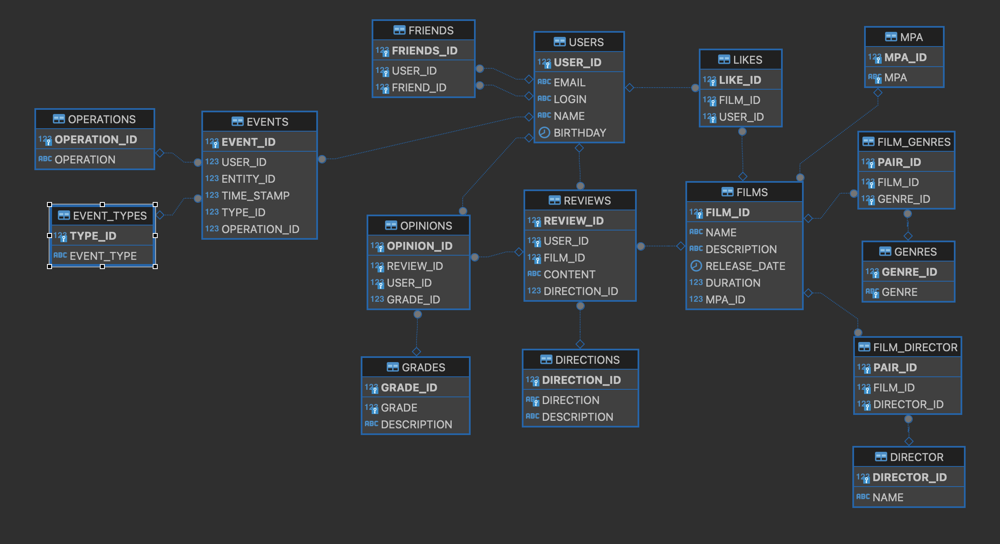

# Реализация проекта Filmorate.
##### Бэкенд сервиса для работы с фильмами, оценками пользователей, а также подготовки рекомендаций для просмотра на основе схожести интересов пользователей.
##### Использовались технологии: Spring Boot, REST, Lombok, Валидация данных (в том числе с созданием кастомных аннотаций), SQL, JDBC, База данных H2, Unit-тестирование.

### Развёртывание проекта
1. Проект выполнен на Java 11; версия Spring Boot 2.7.18.
2. Развёртывание проекта осуществляется в среде разработки через запуск FilmorateApplication.

### Схема базы данных

###  Описание таблиц базы данных
##### Users - содержит информацию о пользователях сервиса
| № | Column Name | Description      | Type    | Key | Reference |
|---|-------------|------------------|---------|-----|-----------|
| 1 | User_Id     | Identifier       | integer | PK  |           |
| 2 | Email       | Email            | varchar |     |           |
| 3 | Login       | Login            | varchar |     |           |
| 4 | Name        | Name             | varchar |     |           |
| 5 | BirthDate   | User`s Birthdate | date    |     |           |
---
##### Films - содержит информацию о фильмах
| № | Column Name | Description      | Type    | Key | Reference |
|---|-------------|------------------|---------|-----|-----------|
| 1 | Film_Id     | Identifier       | integer | PK  |           |
| 2 | Name        | Film Name        | varchar |     |           |
| 3 | Description | Description      | varchar |     |           |
| 4 | ReleaseDate | Release Date     | date    |     |           |
| 5 | Duration    | Duration in mins | integer |     |           |
| 6 | MPA_id      | Rating           | integer | FK  | MPA       |
---
##### Friends - содержит сведения о друзьях пользователя
| № | Column Name | Description       | Type    | Key | Reference |
|---|-------------|-------------------|---------|-----|-----------|
| 1 | Friends_id  | Identifier        | integer | PK  |           |
| 2 | User_id     | User Identifier   | integer | FK  | Users     |
| 3 | Friend_id   | Friend Identifier | integer | FK  | Users     |
---
##### Likes - содержит сведения о лайках пользователей фильмам
| № | Column Name | Description     | Type    | Key | Reference |
|---|-------------|-----------------|---------|-----|-----------|
| 1 | Like_id     | Identifier      | integer | PK  |           |
| 2 | Film_id     | Film Identifier | integer | FK  | Films     |
| 3 | User_id     | User Identifier | integer | FK  | Users     |
---
##### FilmGenres - содержит сведения о жанрах фильмов
| № | Column Name | Description      | Type    | Key | Reference |
|---|-------------|------------------|---------|-----|-----------|
| 1 | Pair_id     | Identifier       | integer | PK  |           |
| 2 | Film_id     | Film Identifier  | integer | FK  | Films     |
| 3 | Genre_id    | Genre Identifier | integer | FK  | Genres    |
---
##### Genres - содержит сведения о доступных жанров
| № | Column Name | Description  | Type    | Key | Reference |
|---|-------------|--------------|---------|-----|-----------|
| 1 | Genre_id    | Identifier   | integer | PK  |           |
| 2 | Genre       | Genre`s name | varchar |     |           |
---
##### MPA - содержит сведения о доступных возрастных ограничениях
| № | Column Name | Description | Type    | Key | Reference |
|---|-------------|-------------|---------|-----|-----------|
| 1 | MPA_id      | Identifier  | integer | PK  |           |
| 2 | MPA         | Rating code | varchar |     |           |
---
##### FilmDirector - содержит сведения о режиссёрах фильмов
| № | Column Name | Description         | Type    | Key | Reference |
|---|-------------|---------------------|---------|-----|-----------|
| 1 | Pair_id     | Identifier          | integer | PK  |           |
| 2 | Film_id     | Film Identifier     | integer | FK  | Films     |
| 3 | Director_id | Director Identifier | integer | FK  | Director  |
---
##### Director - список доступных режиссёров
| № | Column Name | Description     | Type    | Key | Reference |
|---|-------------|-----------------|---------|-----|-----------|
| 1 | Director_id | Identifier      | integer | PK  |           |
| 2 | Name        | Director`s name | varchar |     |           |
---
##### Reviews - содержит сведения об отзывах пользователей на фильмы
| № | Column Name  | Description          | Type    | Key | Reference  |
|---|--------------|----------------------|---------|-----|------------|
| 1 | Review_id    | Identifier           | integer | PK  |            |
| 2 | User_id      | User Identifier      | integer | FK  | Users      |
| 3 | Film_id      | Film Identifier      | integer | FK  | Films      |
| 4 | Content      | User`s review        | varchar |     |            |
| 5 | Direction_id | Direction Identifier | integer | FK  | Directions |
---
##### Directions - возможные характеры отзыва (позитивный или негативный) 
| № | Column Name  | Description      | Type    | Key | Reference |
|---|--------------|------------------|---------|-----|-----------|
| 1 | Direction_Id | Identifier       | integer | PK  |           |
| 2 | Direction    | Direction        | varchar |     |           |
| 3 | Description  | Description      | varchar |     |           |
---
##### Opinions - содержит сведения об оценках отзывов на фильмы
| № | Column Name  | Description          | Type    | Key | Reference  |
|---|--------------|----------------------|---------|-----|------------|
| 1 | Opinion_id   | Identifier           | integer | PK  |            |
| 2 | Review_id    | Review Identifier    | integer | FK  | Reviews    |
| 3 | User_id      | User Identifier      | integer | FK  | Users      |
| 4 | Grade_id     | Grade Identifier     | integer | FK  | Grades     |
---
##### Grades - возможные оценки отзывов (позитивные или негативные)
| № | Column Name | Description | Type    | Key | Reference |
|---|-------------|-------------|---------|-----|-----------|
| 1 | Grade_Id    | Identifier  | integer | PK  |           |
| 2 | Grade       | Grade       | integer |     |           |
| 3 | Description | Description | varchar |     |           |
---
##### Events - содержит сведения о событиях, происходящих на платформе
| № | Column Name  | Description          | Type    | Key | Reference  |
|---|--------------|----------------------|---------|-----|------------|
| 1 | Event_id     | Identifier           | integer | PK  |            |
| 2 | User_id      | User Identifier      | integer | FK  | Users      |
| 3 | Entity_id    | Entity Identifier    | integer |     |            |
| 4 | Timestamp    | Timestamp of event   | integer |     |            |
| 5 | Type_id      | Type Identifier      | integer | FK  | EventTypes |
| 6 | Operation_id | Operation Identifier | integer | FK  | Operations |
---
##### EventTypes - содержит сведения о типах событий, сохраняемых в истории
| № | Column Name | Description | Type    | Key | Reference |
|---|-------------|-------------|---------|-----|-----------|
| 1 | Type_id     | Identifier  | integer | PK  |           |
| 2 | EventType   | Event type  | varchar |     |           |
---
##### Operations - содержит сведения об операциях, сохраняемых в истории
| № | Column Name   | Description | Type    | Key | Reference |
|---|---------------|-------------|---------|-----|-----------|
| 1 | Operation_id  | Identifier  | integer | PK  |           |
| 2 | Operation     | Operation   | varchar |     |           |
---

##   При реализации группового проекта реализована следующая функциональность:

1. Добавление режиссёров в фильмы (Штефан Павел).

   В информацию о фильмах должно быть добавлено имя режиссёра.
   Появилась возможность получить все фильмы режиссёра, отсортированные по:
- количеству лайков;
- годам.
2. Поиск (Штефан Павел).
   
   Реализован поиск по названию фильмов и по режиссёру.
3. Отзывы (Куракин Павел).

   Реализовано добавление отзывов пользователей на фильмы с возможностью оценивать отзывы по степени полезности и рассчитывать рейтинг отзыва.
4. Лента событий (Куракин Павел).

   Добавлена возможность просмотра последних событий на платформе с выводом информации о действиях пользователей.
5. Вывод самых популярных фильмов по жанру и годам (Кузнецова Альбина).

   Добавлена возможность выводить топ-N фильмов по количеству лайков с фильтрацией:
- по жанру;
- за указанный год.
6. Удаление фильмов и пользователей (Кузнецова Альбина).

   Добавлена возможность удаления фильмов и пользователей по идентификатору.
7. Общие фильмы (Морозов Олег).

   Реализован вывод общих с другом фильмов с сортировкой по их популярности.
8. Рекомендации (Морозов Олег).

   Реализована простая рекомендательная система для фильмов на основе анализа предпочтений пользователей.

## В работе над групповым проектом участвовали:

1. Штефан Павел
2. Куракин Павел
3. Кузнецова Альбина
4. Морозов Олег
